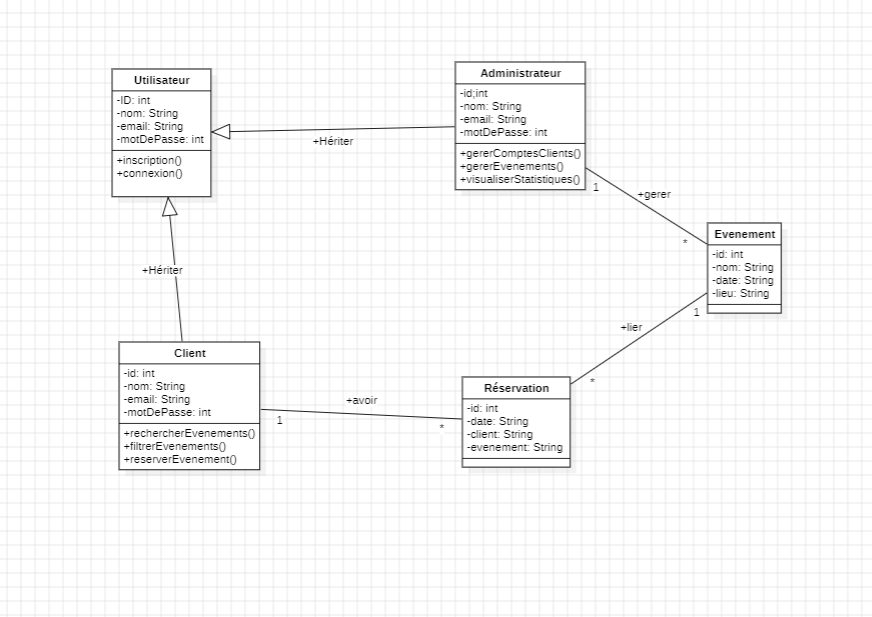
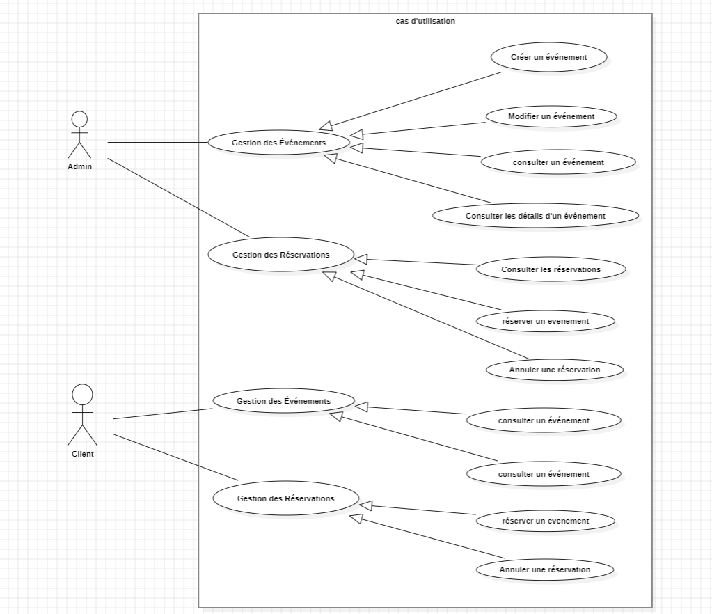

# HelloEvents-App
application de gestion des événements
# 🎉 Application de Réservation d'Événements

## 📖 Description du Projet

Ce projet est une **application web** développée pour permettre la réservation d'événements, répondant aux besoins des clients et des administrateurs d’une entreprise. Le but est de fournir une plateforme simple, sécurisée et efficace pour gérer les événements et les utilisateurs.

---

## ✨ Fonctionnalités

### 👥 Pour les Clients

- 🏠 **Page d'Accueil :**  
  Affichage dynamique des événements à venir.

- 🔐 **Inscription et Connexion :**
    - Création de compte utilisateur.
    - Authentification sécurisée avec **JWT**.
    - Gestion et mise à jour du profil utilisateur.

- 🔎 **Recherche et Filtrage :**  
  Recherche d’événements selon critères : date 📅, lieu 📍, catégorie 🗂️, etc.

- 🎟️ **Réservation d'Événement :**  
  Réservation facile et rapide des événements sélectionnés.

- 💼 **Page À Propos :**  
  Présentation de l’équipe et des valeurs de l’entreprise.

### 🛠️ Pour les Administrateurs

- 📊 **Tableau de Bord :**  
  Statistiques détaillées sur les activités des clients et événements.

- 🧑‍💼 **Gestion des Comptes :**  
  Consultation, modification et suppression des comptes utilisateurs.

- 📅 **Gestion des Événements :**  
  Création, modification, suppression et consultation des événements.

---

## 💻 Technologies Utilisées

- 🌱 **Backend :**
    - Spring Boot
    - Spring MVC
    - Spring Security (JWT)
    - Spring Data JPA
    - JUnit

- 🗄️ **Base de données :**
    - MySQL / PostgreSQL

## 🖼️ Diagrammes du Système

### 📌 Diagramme de classe :

---

### 🗃️ Diagramme de cas d'utilisation :

